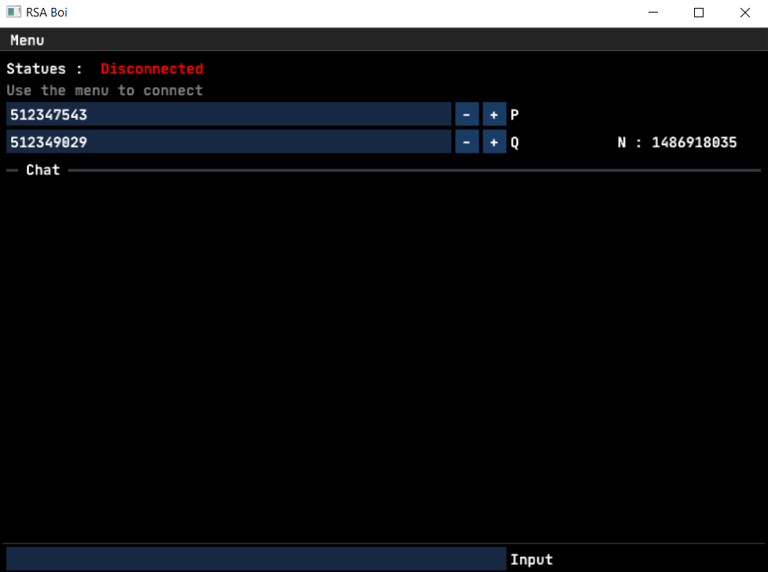
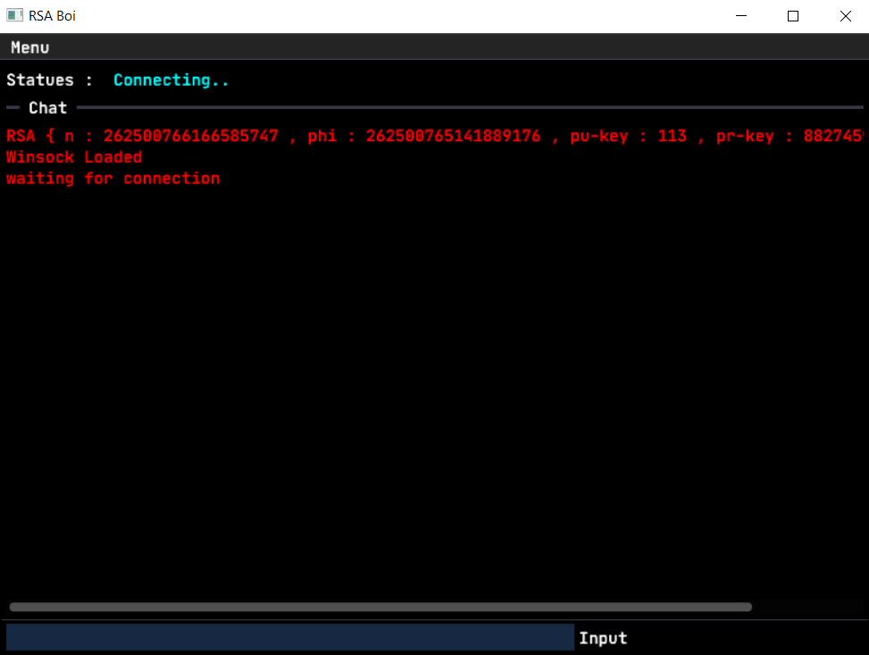
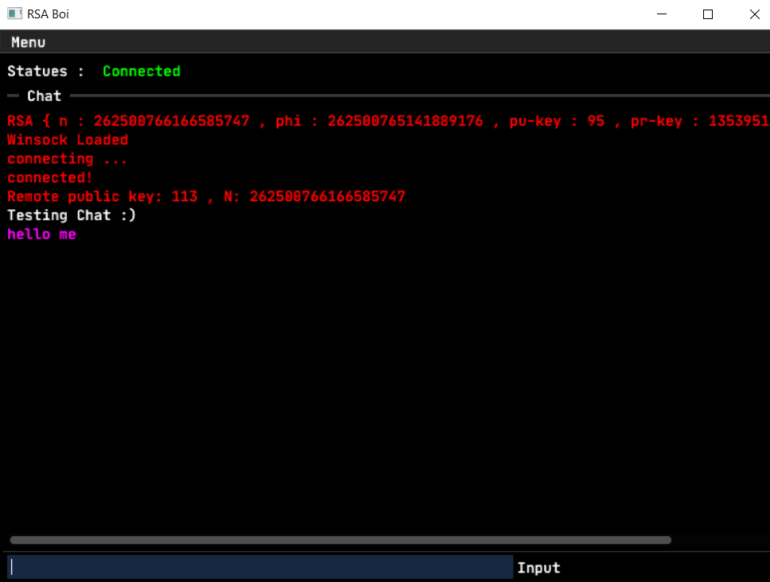

[![Contributors][contributors-shield]][contributors-url]
[![Forks][forks-shield]][forks-url]
[![Stargazers][stars-shield]][stars-url]
[![Issues][issues-shield]][issues-url]
[![MIT License][license-shield]][license-url]

<!-- PROJECT LOGO -->
 

  

  <h3 align="center">Scure RSA-Chat</h3>

  

    This is a demo showcasing a secure chat application built in C++ for Windows. It utilizes RSA encryption to scramble messages before sending, ensuring only the intended recipient can decipher them.
     
    <a href="https://github.com/AbdoWise-z/RSA-SecureChat"><strong>Explore the project</strong></a>
     
     
    <a href="https://github.com/AbdoWise-z/RSA-SecureChat/tree/master/RSA-UI">UI Demo</a>
    ·
    <a href="https://github.com/AbdoWise-z/RSA-SecureChat/issues">Report Bug</a>
    ·
    <a href="https://github.com/AbdoWise-z/RSA-SecureChat/issues">Request Feature</a>
  

<!-- TABLE OF CONTENTS -->

  
Table of Contents

  <ol>
    <li>
      <a href="#about-the-project">About The Project</a>
      <ul>
        <li><a href="#built-with">Built With</a></li>
        <li><a href="#features">Features</a></li>
      </ul>
    </li>
    <li>
      <a href="#getting-started">Getting Started</a>
      <ul>
        <li><a href="#ide">IDE</a></li>
        <li><a href="#build">Building</a></li>
      </ul>
    </li>
    <li><a href="#images">Images</a></li>
    <li><a href="#contributing">Contributing</a></li>
    <li><a href="#license">License</a></li>
    <li><a href="#contact">Contact</a></li>
    <li><a href="#Special-Thanks-to">Special Thanks to</a></li>
  </ol>

<!-- ABOUT THE PROJECT -->
## About The Project

This a chat app written purely in C++/C, it provides an END-TO-END encryption using RSA

The app provides the following:

<ol>
<li> Interactive UI (built using <a herf="https://github.com/ocornut/imgui">ImGui</a>)
<li> RSA Encryption
<li> A utility tool to break RSA keys (RSA-Console)
</ol>

### Built With

[![C++][language-1-shield]][language-1-url]

(<a href="#readme-top">back to top</a>)

## Features

we implemented most of the core features of any chating application such as: 

### Realtime chat
End-to-End Encrypted Real-time chat (with one person)

### RSA Ecnryption
RSA Encryption is applied to all of the message sent and received thuogh the application.

### RSA-Break-Tool
A [utility](https://github.com/AbdoWise-z/RSA-SecureChat/tree/master/RSA-Console) tool to break RSA keys

### Interactive UI
Simple and interactive UI written using [ImGui](https://github.com/ocornut/imgui)

(<a href="#readme-top">back to top</a>)

<!-- GETTING STARTED -->
## Getting Started

To get started into this project localy, you need to have the follow 

### IDE

The project is written in [Visual Studio](https://visualstudio.microsoft.com/), you will need to download it, or any other C++/C editor 

incase you choose to download other IDEs you will need to convert the project since its a Visual Studio Project

### build

incase you want to build an executable application, if you use Visual Studio then kit the build button an you're good to go, otherwise use a build tool like gcc/g++

## images

Inital UI

 

Conecting to another person

 

Conecting to another person

 

Message decryption

 

<!-- CONTRIBUTING -->
## Contributing

Contributions are what make the open source community such an amazing place to learn, inspire, and create. Any contributions you make are **greatly appreciated**.

This project was developed by
<table>
  <tr>
<td align="center">
<a href="https://github.com/AbdoWise-z" target="_black">
 <b>Abdulrahman Mohammed </b>  </a>
</td>
</tr>
 </table>

If you have a suggestion that would make this better, please fork the repo and create a pull request. You can also simply open an issue with the tag "enhancement".
Don't forget to give the project a star! Thanks again!

1. Fork the Project
2. Create your Feature Branch (`git checkout -b feature/AmazingFeature`)
3. Commit your Changes (`git commit -m 'Add some AmazingFeature'`)
4. Push to the Branch (`git push origin feature/AmazingFeature`)
5. Open a Pull Request

(<a href="#readme-top">back to top</a>)

<!-- LICENSE -->
## License

Distributed under the MIT License. See `LICENSE.txt` for more information.

(<a href="#readme-top">back to top</a>)

<!-- CONTACT -->
## Contact

[Abdulrahman Mohammed Abdulfattah](https://www.linkedin.com/in/abdo-mohamed-5b3506252/) - moh2002.abdow@gmail.com

(<a href="#readme-top">back to top</a>)

<!--difiniations -->

[repo]: https://github.com/AbdoWise-z/RSA-SecureChat
[contributors-shield]: https://img.shields.io/github/contributors/AbdoWise-z/RSA-SecureChat?style=for-the-badge
[contributors-url]: https://github.com/AbdoWise-z/RSA-SecureChat/graphs/contributors

[forks-shield]: https://img.shields.io/github/forks/oAbdoWise-z/RSA-SecureChat?style=for-the-badge
[forks-url]: https://github.com/AbdoWise-z/RSA-SecureChat/network/members

[stars-shield]: https://img.shields.io/github/stars/AbdoWise-z/RSA-SecureChat?style=for-the-badge
[stars-url]: https://github.com/AbdoWise-z/RSA-SecureChat/stargazers

[issues-shield]: https://img.shields.io/github/issues/AbdoWise-z/RSA-SecureChat?style=for-the-badge
[issues-url]: https://github.com/AbdoWise-z/RSA-SecureChat/issues

[license-shield]: https://img.shields.io/github/license/AbdoWise-z/RSA-SecureChat?style=for-the-badge
[license-url]: https://github.com/AbdoWise-z/RSA-SecureChat/blob/master/LICENSE.txt

[language-1-shield]: https://img.shields.io/badge/-C++-blue?logo=cplusplus
[language-1-url]: https://gcc.gnu.org/